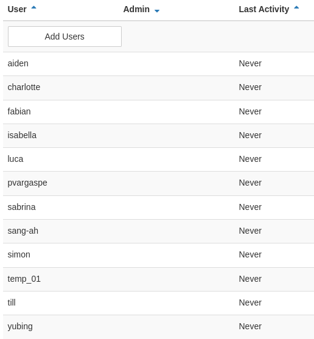

# Seminar Begin Cheat Sheet:

*This is the page for hints beginning of the seminar:*


### URL to the environment:

https://dev.ground-zero.khm.de/jupyter-hub or http://167.235.56.3/

login with your own account and password

### first login...:



find ur name + set your own PW

...after that you'll find an webinterface a bit like this:


## Download New Files from Github:

open Terminal page from `new`


</br>

## Cmd-Line Cheat-Sheet

| **Command** | **Description**                                  |
| ----------- | ------------------------------------------------ |
| touch       | Create a new file                                |
| cd          | Change directory                                 |
| pwd         | Print working directory                          |
| mkdir       | Make directory                                   |
| ls          | List directory contents                          |
| cp          | Copy files and directories                       |
| rm          | Remove files or directories                      |
| cat         | Display file contents                            |
| head/tail   | Read the start or end of a file                  |
| chmod       | Change file permissions                          |
| chown       | Change file ownership                            |
| ps          | Display current processes                        |
| top         | Display active processes                         |
| df          | Display disk usage                               |
| du          | Display directory space usage                    |
| man         | Access manual pages                              |
| history     | View command history                             |
| clear       | Clear the terminal screen                        |
| whoami      | Display the current user                         |
| pkill       | Terminate processes by name                      |
| ping        | Test network connectivity to a remote host       |
| ifconfig    | Configure and display network interface settings |
| ssh         | Secure remote access to another computer         |


### Clone Repo

use `git clone` to clone the repository https://github.com/experimental-informatics/Unveiled-AI in your home-folder

```bash
git clone https://github.com/experimental-informatics/Unveiled-AI.git
```


### Change Direction

use `cd` to move to the directory of our files, a blue line will be seen.

```bash
cd Unveiled-AI
```


### Github Reset
use `git reset` to reset the repository branch, **remember to store your file in other name then the origin files**

```bash
git reset --hard origin/master
```


</br>

### Github Pull (Download)

use `git pull` to download all the new files from the week

```bash
git pull --force
```


## (optional) Changing from `jupyter notebook` interface to `jupyter lab` 

change the url from: `167.235.56.3/user/<yourname>/`

into `167.235.56.3/user/<yourname>/lab`


## starting with the seminar:

Go to the week we are working with.
open a new Python3 (ipykernel)

# **Happy Coding** 